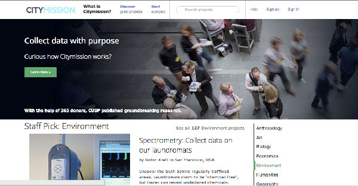

# CityMission

"Know yourself. Know the City."

A platform for collecting and storing citizen generated open data.

## History

This project came to be out of a NYU GovLab Experiement.

## In progress

[http://www.citymish.com/]('http://www.citymish.com/')
[http://www.citymish.com/discover ]('http://www.citymish.com/discover ')
[http://www.citymish.com/projects/1]('http://www.citymish.com/projects/1')
[https://github.com/rememberlenny/Citymish]('https://github.com/rememberlenny/Citymish')

## Contributors

Pablo Aguero - [@RedPabs](https://twitter.com/RedPabs) - UX/UI Design Ninja

Leonard "Lenny" Bogdonoff - [@lkbcc](http://twitter.com/lkbcc) - Developer Extraordinaire

Nathan Storey - [@npstorey](http://twitter.com/npstorey) - Urban Planner/All Things Civic SME and Prod Mgr

Joel Natividad - [@jqnatividad](http://twitter.com/jqnatividad) - Data Wrangler, Prod Design and all-around Civic Hacker

Joshua Kauffman - [@joshuakauffman](https://twitter.com/joshuakauffman) - Concept Distiller
